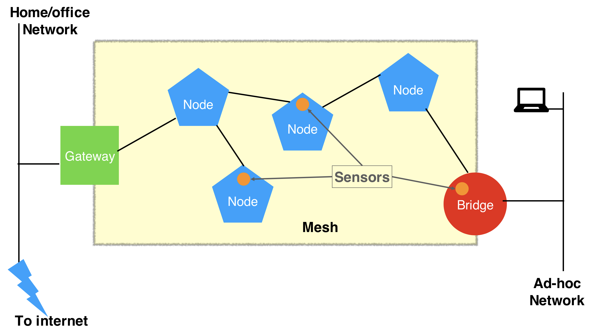

*Quick links :*
***
[**Home**](/README.md) - [Part 1](/part1/README.md) - [Part 2](/part2/README.md) - [Part 3](/part3/README.md) - [Resources](/additionalResources/README.md)
***

# Create a Mesh Network over WiFi using Raspberry Pi

Welcome to this workshop, where you will create a mesh network over WiFI using Raspberry Pis.  After creating the mesh you will use it to extend an existing network, then use the mesh to connect sensors to the Internet and allow other devices (not participating in the mesh) to connect to the Internet via the mesh network.

## Expected outcomes

After completing this workshop you should be able to :

- understand how mesh networks work at a high level
- create a mesh network using Raspberry Pis
- connect the mesh to an existing network, understanding the difference between routing and bridging network traffic
- enable non-mesh devices to use the mesh to connect to the Internet
- create a sensor application on a mesh node which securely communicates with a cloud application

## Prerequisites

To complete this workshop you need some hardware and some prerequisite knowledge.  Mode details about the prerequisites is available in the [Additional Resources section](/additionalResources/README.md) :

- A minimum of 2 raspberry Pis (3 or 4 Model B(+)) additional Pis can be added to extend the mesh, which can also include Pi Zero(W).  You also need to have an SD card to hold the filesystem and a power supply for each Raspberry Pi and optionally a keyboard, mouse and monitor if not doing headerless setup (details in [Additional Resources](/additionalResources/README.md))
- A laptop or desktop computer with a modern OS (Linux, MacOS or Windows - windows users will need additional software to communicate with Raspberry Pis if using [headerless setup](/additionalResources/HEADERLESS_SETUP.md))
- Ability to flash the SD card for the raspberry Pi (SD card slot in laptop or USB adapter and [appropriate software](https://etcher.io))
- Ethernet network, cables and connection to connect Laptop to Ethernet (if this isn't available then WiFi is also possible)
- Internet connectivity is required
- Optional WiFi USB dongle(s) if want to enable WiFi rather than Ethernet connectivity (*Note: some WiFi dongles need more power than a Raspberry Pi USB interface can supply, so a powered USB hub may be needed*)
- DHT11 or DHT22 temperature and humidity sensor and an addressable RGB LED. You also need 6 Female to Female connector cables. Additional details about of these components are available in the [Additional Resources section](/additionalResources/README.md)
- You should be able to setup a Raspberry Pi and get access to a command line on the Pi (help available in the [Additional Resources section](/additionalResources/README.md))
- You should be familiar with basic linux command line commands and be able to edit a text file on the command line.  If you need help there is a section on the [raspberry pi site](https://www.raspberrypi.org/documentation/linux/usage/text-editors.md) and there are plenty of tutorials available with a quick web search.  For new users, nano will be an easier option than vi and remember **^x** means hold the control key then press x.
- An [IBM public Cloud account](https://cloud.ibm.com/login) (the free, lite account is OK, if you have resources available in the account to deploy an application)

## Outline

This workshop is split into 3 parts:

- [Part 1](/part1/README.md) will setup the mesh network using at least 2 Raspberry Pi boards.  Part 1 assumes that Ethernet connectivity is available to connect the mesh network to your home network (Gateway node connection to Home/Office network in above image) and also allow a non-mesh device to use the mesh network to access the internet (Bridge node connection to Ad-Hoc network in above image), as shown on the image at the top of the page.
- [Part 2](/part2/README.md) is optional.  It converts the Ethernet connection joining the mesh to your home/office network to WiFi.  It also provides a WiFi access point to allow other devices to use the mesh to get to your home/office network and onto the Internet.

- [Part 3](/part3/README.md) creates an Internet of Things application to sense temperature and humidity and then sends the data to the IBM Cloud.  An application running on the IBM Cloud receives and processed the sensor data then sends a command back to the raspberry Pi to set the colour of a multi-coloured LED light.  The mesh network is used connect the Raspberry Pi hosting the sensor and LED to the Internet, allowing it to send and receive SSL encrypted data.

## Network connectivity

During the workshop you will be switching your laptop to use local networking created by mesh nodes.  Until the mesh is fully operational you may have times when you need to work on a Raspberry Pi, but loose internet connectivity on your laptop.  You may find it useful to clone this git repository locally, so you can still access the content when offline.

Before starting, you should make sure you have all the [prerequisites and setup](/additionalResources/PREREQUISITES_AND_SETUP.md) completed.  Once the setup is complete move onto [part 1](/part1/README.md) to get started.

***
*Quick links :*
***
[**Home**](/README.md) - [Part 1](/part1/README.md) - [Part 2](/part2/README.md) - [Part 3](/part3/README.md) - [Resources](/additionalResources/README.md)
